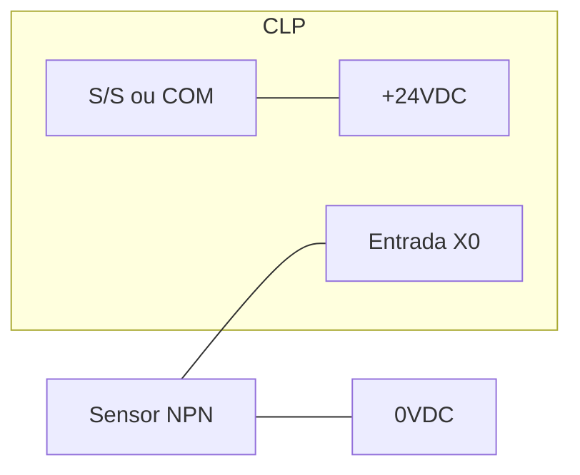
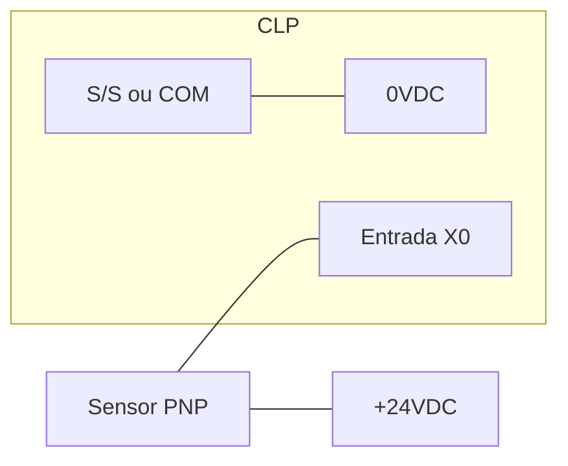
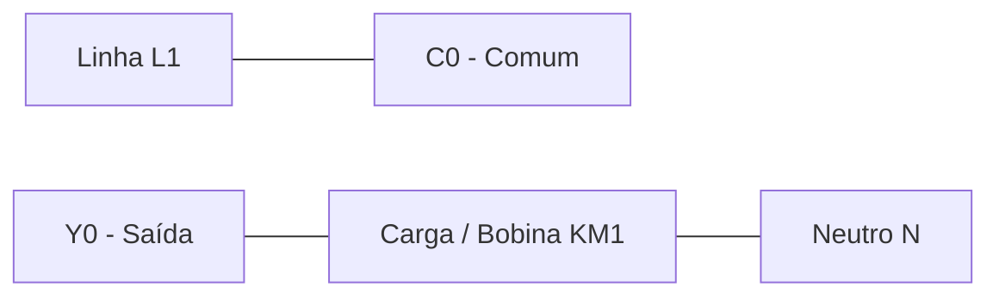

# 07 - Esquemas Elétricos e Ligações de I/O

A correta ligação elétrica evita a queima de portas do CLP e garante a leitura correta dos sinais.

## 1. Ligação de Entradas Digitais (Sinking vs Sourcing)

### Lógica Sinking (NPN)
O CLP fornece o comum positivo (24V). O sensor fecha o circuito no Negativo (0V).

### Lógica Sourcing (PNP)
O sensor fornece o positivo (24V) para a entrada do CLP.

## 2. Ligação de Saídas (Relé vs Transistor)

### Saída a Relé
Funciona como um contato seco. Pode chavear AC ou DC.

## 3. Ligação de Sinais Analógicos
Sinais analógicos são sensíveis. Sempre use cabos **blindados (shielded)**.
-   **V+ / I+**: Sinal positivo.
-   **V- / I- / COM**: Sinal negativo/comum.
-   **FG (Frame Ground)**: Onde a malha do cabo deve ser aterrada (apenas em uma das extremidades).

---
*Módulo 01 - Hardware*
