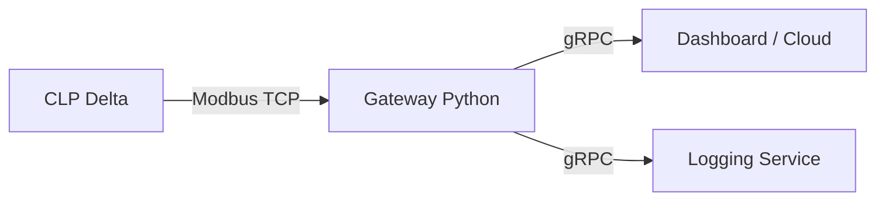

# 01 - gRPC na Automação Industrial

O gRPC é uma tecnologia moderna do Google para chamadas de procedimento remoto (RPC) de alta performance, que utiliza o **Protocol Buffers (protobuf)** como formato de serialização.

## Por que usar gRPC com CLPs?
Enquanto o Modbus é ótimo para falar com o hardware, ele não é amigável para interfaces web ou sistemas de nuvem modernos. O gRPC serve como uma "ponte" (Gateway):



## Vantagens
1.  **Tipagem Forte**: Diferente do JSON, o gRPC garante que o dado enviado é do tipo esperado (int32, float, bool).
2.  **Streaming**: Permite enviar fluxos de dados em tempo real sem precisar abrir novas conexões a cada requisição.
3.  **Performance**: O formato binário do protobuf é muito menor e mais rápido de processar que o texto (JSON/XML).

## Definição de Mensagem (.proto)
Exemplo de um estado de motor:
```protobuf
message MotorStatus {
  int32 id = 1;
  bool running = 2;
  float speed = 3;
  string last_error = 4;
}
```

---
*Módulo 05 - Integração*
