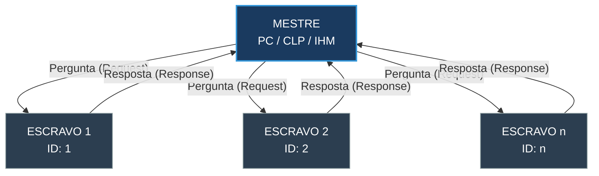

# 02 - Modbus RTU e RS-485

O Modbus RTU sobre RS-485 é o protocolo mais difundido na indústria devido à sua simplicidade e baixo custo.

## 1. A Camada Física RS-485
O RS-485 utiliza **sinais diferenciais** (fios A e B). A diferença de tensão entre os dois fios determina o bit, o que o torna extremamente imune a ruídos.

### Regras de Ouro do RS-485:
- **Topologia em Varal (Daisy Chain)**: Os dispositivos devem ser conectados um após o outro. Evite derivações em estrela.
- **Resistores de Terminação**: Um resistor de 120 ohms deve ser colocado em cada extremidade da rede para evitar a reflexão do sinal.
- **Aterramento do Shield**: A malha do cabo deve ser aterrada em apenas UM ponto para evitar loops de terra.

## 2. O Protocolo Modbus RTU
- **Mestre/Escravo**: Apenas o mestre inicia a comunicação. O escravo apenas responde.
- **Endereçamento**: Cada escravo deve ter um ID único (1 a 247).
- **Parâmetros de Porta**: Todos os dispositivos na rede devem ter o mesmo Baud Rate (ex: 9600, 19200, 38400) e Paridade.

## 3. Esquema Mestre-Escravo (Topology)

Diferente de redes Ethernet onde vários dispositivos podem falar ao mesmo tempo, no Modbus RTU existe uma hierarquia rígida.

### Funcionamento do Ciclo:
1. **O Mestre** envia um pacote contendo o ID do escravo alvo.
2. **Todos os Escravos** recebem o pacote, mas apenas aquele com o ID correspondente o processa.
3. **O Escravo** processa a solicitação e envia uma resposta de volta ao mestre.
4. **O Mestre** aguarda a resposta (Timeout) antes de enviar a próxima pergunta para o mesmo ou outro escravo.

## 4. Códigos de Função (Function Codes)

O Código de Função diz ao escravo qual tipo de dado o mestre quer acessar e se é uma operação de leitura ou escrita.

### Principais Códigos de Leitura:
| Código | Nome | O que lê? | Tipo Delta DVP |
| :--- | :--- | :--- | :--- |
| **01 (0x01)** | Read Coils | Saídas Digitais (Bits) | Y, M, S |
| **02 (0x02)** | Read Discrete Inputs | Entradas Digitais (Bits) | X |
| **03 (0x03)** | Read Holding Registers | Registradores (16-bit) | D, T (valor), C (valor) |
| **04 (0x04)** | Read Input Registers | Registradores de Entrada | Módulos Analógicos |

### Principais Códigos de Escrita:
| Código | Nome | O que escreve? | Uso Comum |
| :--- | :--- | :--- | :--- |
| **05 (0x05)** | Write Single Coil | Um único Bit | Ligar/Desligar Motor |
| **06 (0x06)** | Write Single Register | Um único Registrador | Mudar Setpoint |
| **15 (0x0F)** | Write Multiple Coils | Vários Bits | Resetar Alarmes |
| **16 (0x10)** | Write Multiple Registers | Bloco de Registradores | Carregar Receita |

### Respostas de Erro (Exceções)
Se o mestre solicitar um endereço que não existe ou uma função não suportada, o escravo responde com o **Código da Função + 0x80**.
*Exemplo: Se você enviar Função 03 para um escravo que não a suporta, ele responderá com 0x83 e um código de erro (01: Função Ilegal, 02: Endereço Ilegal).*

---
*Módulo 09 - Redes e Protocolos Industriais*
